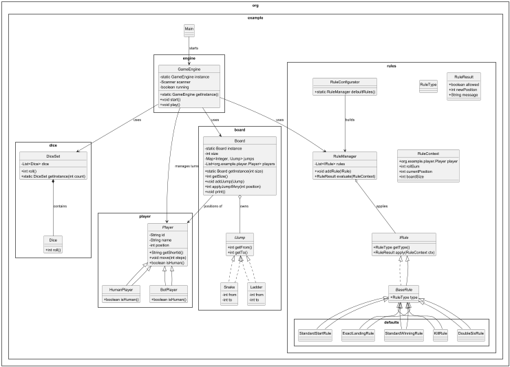

# Snake & Ladder Game

A comprehensive implementation of the classic Snake & Ladder board game in Java, featuring a flexible rule system, multiple player types, and extensive customization options.

## Table of Contents

- [Features](#features)
- [Architecture Overview](#architecture-overview)
- [System Requirements](#system-requirements)
- [Installation & Setup](#installation--setup)
- [Quick Start Guide](#quick-start-guide)
- [Detailed Usage](#detailed-usage)
- [UML Diagram](#uml-diagram)


## Features

### Core Game Features
- **Customizable Board Size**: Create boards from 2x2 to 20x20
- **Multiple Player Support**: 2-20 players (Human and Bot)
- **Multiple Dice Support**: Use 1-6 dice simultaneously
- **Dynamic Snakes & Ladders**: Randomly generated positions each game
- **Visual Board Display**: ASCII-based board visualization
- **Real-time Position Tracking**: See all player positions on board

### Advanced Features
- **Flexible Rule System**: Enable/disable and prioritize game rules
- **Custom Game Rules**: Implement your own rules easily
- **Bot Players**: AI players with configurable behavior
- **Rule Configuration**: Interactive rule setup during game start
- **Turn Management**: Smooth transitions between different player types
- **Win Conditions**: Customizable winning criteria

### Built-in Game Rules
1. **Standard Start**: All players begin at position 1
2. **Standard Win**: First player to reach the last cell wins
3. **Exact Landing**: Must land exactly on the last cell to win
4. **Double Six**: Roll again when you get a 6
5. **Kill Players**: Send other players back to start if you land on them

## Architecture Overview

The game follows a modular, object-oriented architecture with clear separation of concerns:

```
┌─────────────────┐    ┌─────────────────┐    ┌─────────────────┐
│   GameEngine    │───▶│   RuleManager   │───▶│   IRule (Rules) │
│                 │    │                 │    │                 │
└─────────────────┘    └─────────────────┘    └─────────────────┘
         │                       │                       │
         ▼                       ▼                       ▼
┌─────────────────┐    ┌─────────────────┐    ┌─────────────────┐
│      Board      │    │   RuleContext   │    │   RuleResult    │
│                 │    │                 │    │                 │
└─────────────────┘    └─────────────────┘    └─────────────────┘
         │
         ▼
┌─────────────────┐    ┌─────────────────┐    ┌─────────────────┐
│     Player      │    │     DiceSet     │    │     IJump       │
│                 │    │                 │    │                 │
└─────────────────┘    └─────────────────┘    └─────────────────┘
         │                                             │
    ┌────┴────┐                                   ┌────┴────┐
    ▼         ▼                                   ▼         ▼
┌────────┐ ┌────────┐                       ┌────────┐ ┌────────┐
│ Human  │ │  Bot   │                       │ Snake  │ │ Ladder │
│ Player │ │ Player │                       │        │ │        │
└────────┘ └────────┘                       └────────┘ └────────┘
```

## System Requirements

- **Java**: JDK 17 or higher
- **Memory**: 64MB RAM minimum
- **Storage**: 50MB free space
- **OS**: Windows, macOS, or Linux

## Installation & Setup

### Option 1: Clone and Build
```bash
# Clone the repository
git clone https://github.com/yourusername/snake-ladder-game.git
cd snake-ladder-game

# Compile the project
javac -d out src/org/example/*.java src/org/example/*/*.java src/org/example/*/*/*.java

# Run the game
java -cp out org.example.Main
```

### Option 2: Using IDE
1. Import the project into your IDE (IntelliJ IDEA, Eclipse, etc.)
2. Ensure Java 17+ is configured
3. Build the project
4. Run the `Main.java` file

### Directory Structure
```
snake-ladder-game/
├── src/
│   └── org/
│       └── example/
│           ├── Main.java
│           ├── board/
│           │   ├── Board.java
│           │   ├── IJump.java
│           │   ├── Snake.java
│           │   └── Ladder.java
│           ├── dice/
│           │   ├── Dice.java
│           │   └── DiceSet.java
│           ├── engine/
│           │   └── GameEngine.java
│           ├── player/
│           │   ├── Player.java
│           │   ├── HumanPlayer.java
│           │   └── BotPlayer.java
│           └── rules/
│               ├── IRule.java
│               ├── BaseRule.java
│               ├── RuleManager.java
│               ├── RuleContext.java
│               ├── RuleResult.java
│               ├── RuleType.java
│               ├── RuleConfigurator.java
│               └── defaults/
│                   ├── StandardStartRule.java
│                   ├── StandardWinningRule.java
│                   ├── ExactLandingRule.java
│                   ├── DoubleSixRule.java
│                   └── KillRule.java
├── README.md
└── docs/
```

## Quick Start Guide

### Basic Game Setup
1. **Run the application**:
   ```bash
   java -cp out org.example.Main
   ```

2. **Configure the game**:
    - Board size: Choose between 2x2 and 20x20 (recommended: 10x10)
    - Number of players: 2-20 players
    - Number of dice: 1-6 dice

3. **Setup players**:
    - For each player, enter: `H:PlayerName` (Human) or `B:BotName` (Bot)
    - Example: `H:Alice`, `B:ComputerPlayer`

4. **Optional rule configuration**:
    - Choose 'y' to configure rules
    - Enable/disable specific rules
    - Adjust rule priorities

5. **Play the game**:
    - Human players: Press Enter to roll dice
    - Bot players: Automatically roll after a short delay
    - Follow on-screen instructions

### Sample Game Session
```
Welcome to Snake & Ladder
Enter board size (n for n*n board, n>=2): 10
Enter number of players (>=2): 2
Enter number of dice to use (1 to 1): 1

Would you like to configure game rules? (y/N): n

Enter player type and name (H:Human/B:Bot Name): H:Alice
Enter player type and name (H:Human/B:Bot Name): B:Computer

>>> All players positioned at start (position 1)

--- Board ---
100      99      98      97      96      95      94      93      92      91
 81      82      83      84      85      86      87      88      89      90
 80      79      78      77      76      75      74      73      72      71
 61      62      63      64      65      66      67      68      69      70
 60      59      58      57      56      55      54      53      52      51
 41      42      43      44      45      46      47      48      49      50
 40      39      38      37      36      35      34      33      32      31
 21      22      23      24      25      26      27      28      29      30
 20      19      18      17      16      15      14      13      12      11
  1[P1, B2]   2       3       4       5       6       7       8       9      10
-------------

=== TURN 1 ===
Alice's turn
Current position: 1

Alice, press Enter to roll dice... 
Alice rolled: 4
Moved to position: 5
```

## Detailed Usage

### Game Configuration

#### Board Size Selection
- **Small boards (2x2 to 5x5)**: Quick games, fewer strategic elements
- **Medium boards (6x6 to 10x10)**: Balanced gameplay, recommended for most games
- **Large boards (11x11 to 20x20)**: Long games, more snakes and ladders

#### Player Types
- **Human Players**: Interactive players who manually roll dice
- **Bot Players**: Computer-controlled players with automatic dice rolling

#### Dice Configuration
- **Single Die**: Traditional gameplay
- **Multiple Dice**: Faster movement, higher variance in rolls

### Rule System

#### Available Rules
1. **Standard Start** (Priority: 100)
    - All players start at position 1
    - Executed at game start

2. **Standard Win** (Priority: 100)
    - First player to reach the last cell wins
    - Checked after each move

3. **Exact Landing** (Priority: 50)
    - Players must land exactly on the last cell
    - Cannot exceed the final position

4. **Double Six** (Priority: 75)
    - Players get an extra turn when rolling 6
    - Applies to single die only

5. **Kill Players** (Priority: 80)
    - Players landing on occupied cells send others back to start
    - Creates strategic gameplay elements

#### Rule Configuration Options
- **View Rules**: Display all available rules and their status
- **Enable/Disable**: Toggle rules on/off
- **Change Priorities**: Adjust execution order (higher priority = executes first)
- **Default Configuration**: Reset to recommended settings

### Advanced Gameplay Features

#### Board Display Elements
- **Cell Numbers**: Shows position numbers
- **Snakes**: Displayed as `S→destination`
- **Ladders**: Displayed as `L→destination`
- **Player Positions**: Shows player IDs at their positions
- **Zigzag Layout**: Traditional snake & ladder board pattern

#### Turn Management
- **Human Turn**: Player presses Enter to roll
- **Bot Turn**: Automatic roll with visual delay
- **Turn Transitions**: Smooth handoff between players
- **Extra Turns**: Automatic handling of bonus turns

## UML Diagram
  
